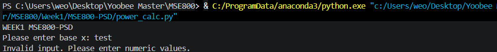

## Description
This small program is for power calculation
## Development Environment
#### 1. anaconda info

## Testing result
#### Positive Test Case: Input x=2, y=3, Expected Result: 8

#### Negative Test Case: Input x=test, Expected Error: Invalid Input.
