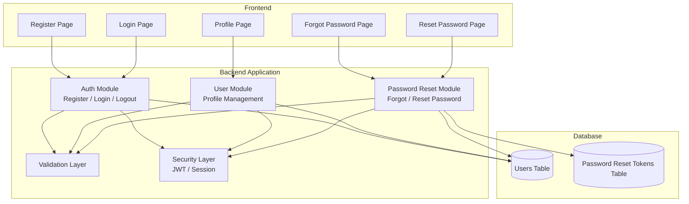
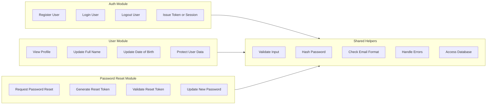
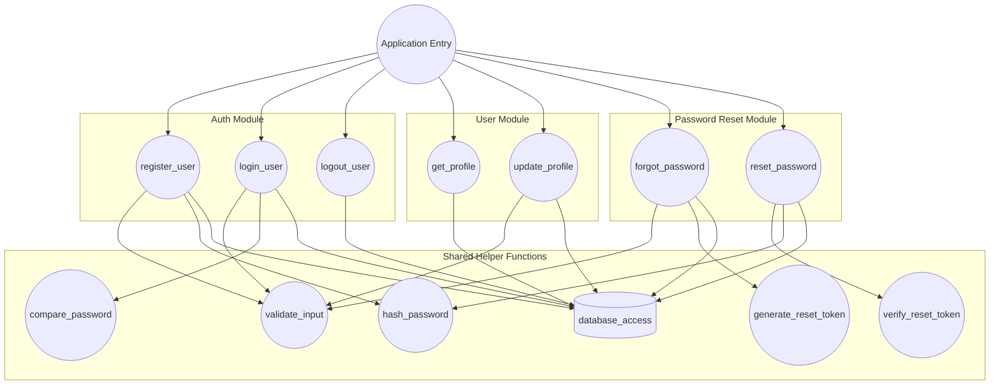
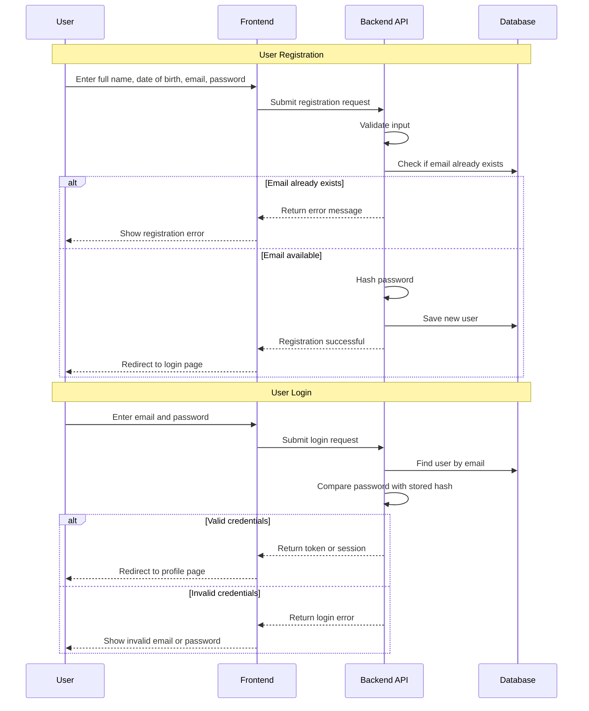
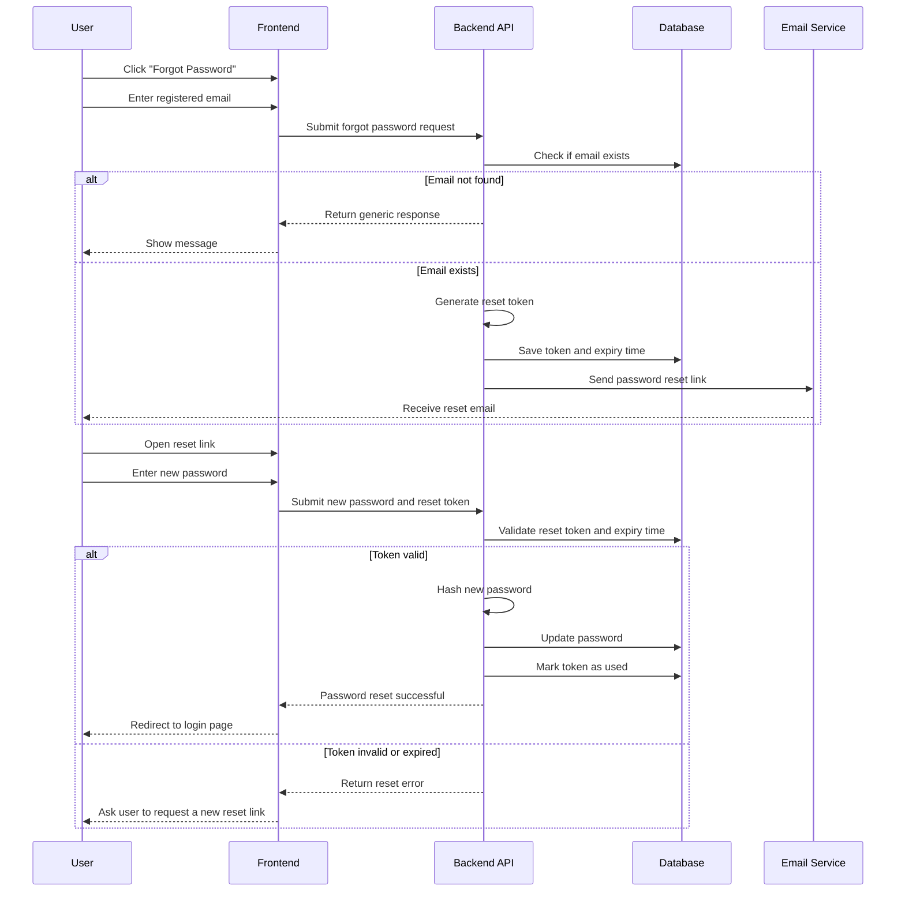
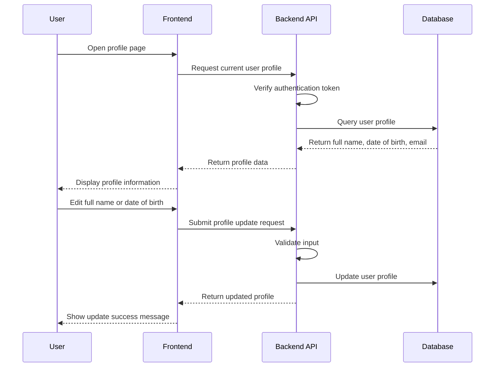
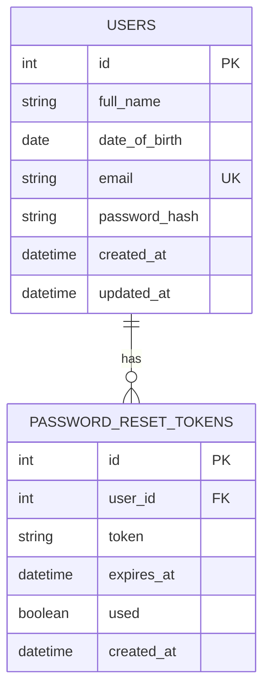

# User Account Management System — Design Document

A simple user account management system that supports user registration, login, profile management, and forgot password functionality.

The system is designed to be maintainable, scalable, and easy to read by separating responsibilities into frontend pages, backend modules, shared helpers, and database tables.

---

## 1. System Architecture



---

## 2. Module Breakdown



---

## 3. Call Graph



---

## 4. Registration and Login Flow



---

## 5. Forgot Password Flow



---

## 6. Profile Management Flow



---

## 7. Data Model



---

## 8. Function Responsibilities

| Layer          | Function               | Responsibility                                                         |
| -------------- | ---------------------- | ---------------------------------------------------------------------- |
| Entry          | `main`                 | Application entry point and route registration                         |
| Auth           | `register_user`        | Register a new user with full name, date of birth, email, and password |
| Auth           | `login_user`           | Verify user credentials and create a login session or token            |
| Auth           | `logout_user`          | Clear user session or remove client-side token                         |
| User           | `get_profile`          | Retrieve the current user's personal information                       |
| User           | `update_profile`       | Update full name and date of birth                                     |
| Password Reset | `forgot_password`      | Generate a password reset token for a registered email                 |
| Password Reset | `reset_password`       | Validate token and update the user's password                          |
| Helper         | `validate_input`       | Validate form fields and prevent invalid data                          |
| Helper         | `hash_password`        | Hash passwords before storing them                                     |
| Helper         | `generate_reset_token` | Create a secure reset token                                            |
| Helper         | `database_access`      | Handle insert, update, and query operations                            |

---

## 9. Design Principles

### Maintainability

The system is divided into clear modules: Auth, User, Password Reset, Shared Helpers, and Database. Each module has a single responsibility, making the code easier to modify and debug.

### Scalability

The password reset logic is separated from the authentication logic. This allows future improvements such as email verification, two-factor authentication, or a separate notification service without changing the whole system structure.

### Readability

The project uses clear naming, simple module boundaries, and a small number of database tables. New developers can understand the system flow by reading the diagrams and function responsibility table.

---

## 10. GitHub Repository Requirement

The project should be uploaded to GitHub with a README file that includes:

* Project description
* Main features
* System architecture diagram
* Module breakdown diagram
* User flow diagrams
* Data model diagram
* Technology stack
* How to run the project
* API endpoint description

```
```
