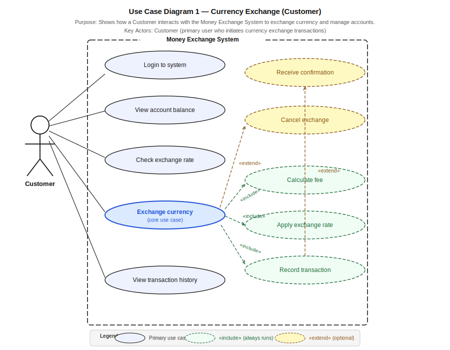
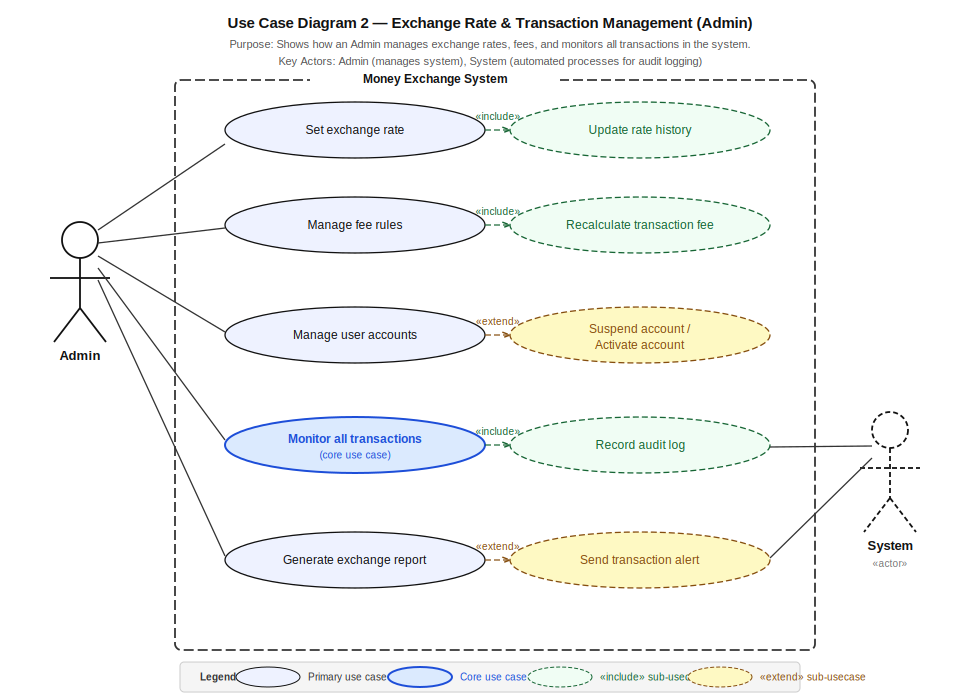

# Money Exchange Application — UML Use Case Diagrams

> **Course Assignment W3-A3**
> UML Use Case Diagrams based on the ER design from W3-A2.

---

## Project Structure

```
usecase_diagrams/
├── diagram1_customer_exchange.svg    # Use Case Diagram 1 — Customer
├── diagram2_admin_management.svg     # Use Case Diagram 2 — Admin
└── README.md                         # This file
```

---

## How to Open the SVG Files

> **Do NOT open `.svg` files directly in PyCharm or a code editor** —
> they may show encoding errors due to special Unicode characters.

**Recommended ways to view:**

| Method | Steps |
|---|---|
| **Browser** | Double-click the `.svg` file → opens in Chrome / Safari / Firefox |
| **Draw.io** | Go to https://app.diagrams.net → File → Open → select the `.svg` file |
| **Inkscape** | Free vector editor, open `.svg` directly |
| **Word / PowerPoint** | Insert → Pictures → select the `.svg` file |

---

## Diagram 1 — Customer Currency Exchange

**UML:** 

**Purpose:**
This diagram shows how a Customer interacts with the Money Exchange System
to perform currency exchange operations. It covers the full exchange workflow
from login through to receiving a transaction confirmation.

**Key Actor:**
- **Customer** — a registered user who initiates currency exchange transactions

**Use Cases:**

| Use Case | Type | Description |
|---|---|---|
| Login to system | Primary | Customer authenticates to access the system |
| View account balance | Primary | Customer checks balance across currency accounts |
| Check exchange rate | Primary | Customer views the current rate for a currency pair |
| Exchange currency | **Core** | Customer submits a currency exchange request |
| Calculate fee | include | System automatically calculates the applicable fee |
| Apply exchange rate | include | System applies the current rate from exchange_rate table |
| Record transaction | include | System saves the completed transaction |
| View transaction history | Primary | Customer views past exchange records |
| Cancel exchange | extend | Customer optionally cancels a pending exchange |
| Receive confirmation | extend | System optionally sends a confirmation after completing |

**Relationship to database (W3-A2):**
- Exchange currency → writes to `transaction` table
- Calculate fee → reads from `fee` table
- Apply exchange rate → reads from `exchange_rate` table
- Record transaction → writes to `audit_log` table
- View account balance → reads from `account` table

---

## Diagram 2 — Admin and System Management

**UML:** 

**Purpose:**
This diagram shows how an Admin manages the back-end of the Money Exchange System,
including setting exchange rates, managing fee rules, monitoring all transactions,
and generating reports. A secondary System actor represents automated processes.

**Key Actors:**
- **Admin** — manages system configuration and monitors activity
- **System** (secondary, dashed) — automated processes for audit logging and alerts

**Use Cases:**

| Use Case | Type | Description |
|---|---|---|
| Set exchange rate | Primary | Admin creates or updates a currency pair rate |
| Manage fee rules | Primary | Admin creates or updates fee structures |
| Manage user accounts | Primary | Admin views and manages registered users |
| Monitor all transactions | **Core** | Admin oversees all currency exchange transactions |
| Generate exchange report | Primary | Admin exports a summary of exchange activity |
| Update rate history | include | System archives old rates when a new rate is set |
| Recalculate transaction fee | include | System recalculates fees when fee rules change |
| Record audit log | include | System records every admin action to audit_log table |
| Suspend / Activate account | extend | Admin optionally suspends or reactivates a user account |
| Send transaction alert | extend | System optionally sends an alert on suspicious activity |

**Relationship to database (W3-A2):**
- Set exchange rate → writes to `exchange_rate` table
- Manage fee rules → writes to `fee` table
- Monitor all transactions → reads from `transaction` table
- Record audit log → writes to `audit_log` table
- Manage user accounts → reads/writes to `user` and `account` tables

---++

## UML Notation Guide

| Symbol | Meaning |
|---|---|
| Rectangle with dashed border | System boundary |
| Stick figure (solid) | Primary actor (human user) |
| Stick figure (dashed) | Secondary actor (automated system) |
| Solid ellipse | Primary use case |
| Blue solid ellipse | Core use case |
| Green dashed ellipse | include sub-use case (always executes) |
| Yellow dashed ellipse | extend sub-use case (conditionally executes) |
| Solid line (no arrow) | Association between actor and use case |
| Dashed arrow include | Base use case always triggers this sub-use case |
| Dashed arrow extend | This use case optionally extends the base use case |

---

## Connection to ER Design (W3-A2)

The use case diagrams are directly derived from the 7-table ER design:

| Table | Related Use Cases |
|---|---|
| user | Login, Manage user accounts |
| account | View account balance |
| currency | Check exchange rate |
| exchange_rate | Set exchange rate, Apply exchange rate |
| fee | Manage fee rules, Calculate fee |
| transaction | Exchange currency, Monitor all transactions |
| audit_log | Record audit log, Record transaction |

---

## Author

Student Assignment W3-A3
Money Exchange Application UML Use Case Diagrams
Based on ER Design from W3-A2
