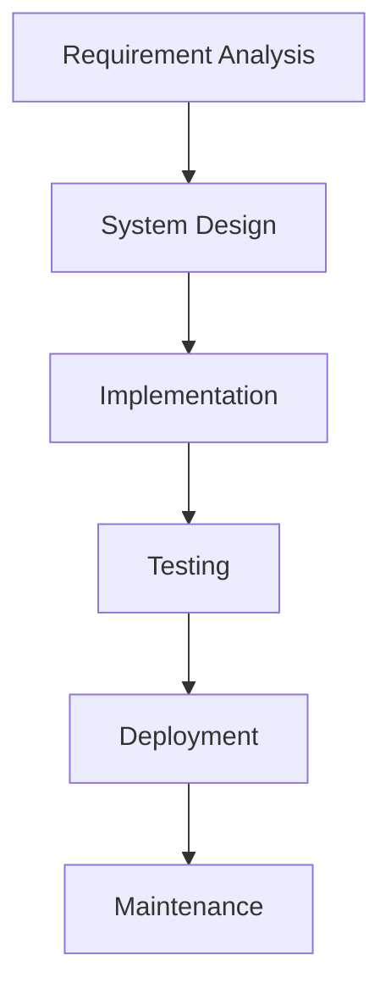
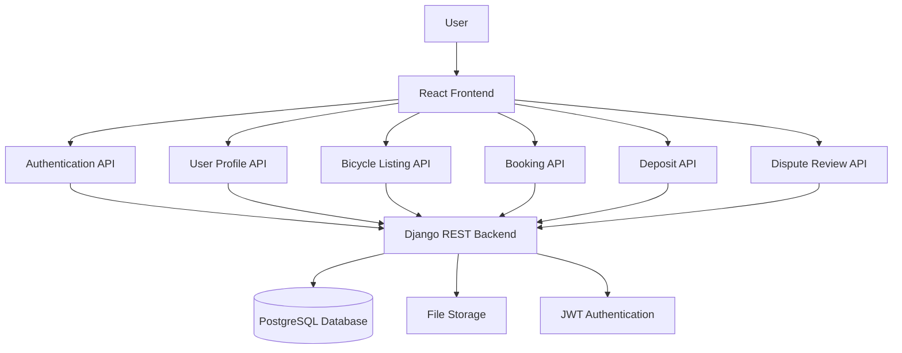
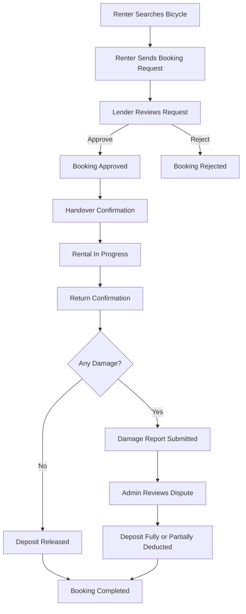
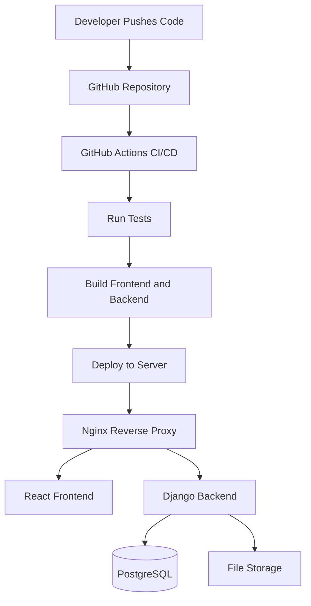

# Waterfall Methodology

## Project Information

**Project Title:**
Peer-to-Peer Bicycle Rental Platform

**Group Name:**
Group-D

**Team Members:**

* Dongfang Wang
* Xiaoning Li

---

## 1. Overview

This document describes how the Waterfall methodology will be applied to the development of the Peer-to-Peer Bicycle Rental Platform.

The Waterfall model is a structured and sequential software development approach. Each phase is completed before the next phase begins. This method is suitable for this project because the main system requirements, user roles, and rental workflow are clearly defined before implementation.

The Peer-to-Peer Bicycle Rental Platform allows users to rent bicycles from other users. A user may act as a renter, a lender, or both. The platform includes user account management, bicycle listing, search, booking, deposit calculation, rental tracking, and basic dispute handling.

---

## 2. Waterfall Model Diagram

---

## 3. Requirement Analysis

The first phase of the Waterfall model is requirement analysis. In this phase, the main functional and non-functional requirements of the platform are identified.

The system must support user registration, login, logout, and profile management. Each user should be able to provide basic personal information and choose whether to use the platform as a renter, lender, or both.

For lenders, the system must allow bicycle owners to create and manage bicycle listings. Each listing should include bicycle photos, ownership evidence, location, availability, bicycle type, size, condition, original price, and rental price.

For renters, the system must allow users to search for available bicycles using different filters. These filters may include location, bicycle type, size, rental price, condition, and availability. After finding a suitable bicycle, the renter can send a booking request to the lender.

The platform also requires a complete rental workflow. This includes booking request submission, lender approval or rejection, handover confirmation, rental status tracking, return confirmation, damage reporting, and admin dispute review.

For the MVP version, the system will not include real online payment. Instead, it will use a simulated deposit calculation based on bicycle value, age, and condition.

---

## 4. System Design

The system design phase defines the technical structure of the platform before development begins.

The platform will be divided into several main parts:

* Frontend application
* Backend application
* Database
* Authentication module
* File upload module
* Admin review module
* Deployment environment

The backend will be developed using **Python, Django, and Django REST Framework**. It will provide REST APIs for authentication, user profiles, bicycle listings, bookings, deposits, damage reports, and admin review.

The frontend will be developed using **React, Vite, Axios, and React Router**. It will provide separate user interfaces for renters, lenders, and administrators.

The database will use **PostgreSQL**. It will store user information, bicycle listing data, booking records, deposit records, uploaded file references, and dispute review information.

JWT authentication will be used to protect private APIs and manage user access. Docker will be used to containerise the frontend, backend, and database during development and deployment.

---

## 5. System Architecture Diagram

---

## 6. Implementation

In the implementation phase, the planned system modules will be developed according to the system design.

The backend will include database models, serializers, views, API endpoints, authentication logic, file upload handling, and admin review functions.

The frontend will include pages and components for:

* Registration
* Login
* Profile management
* Bicycle listing creation
* Bicycle search
* Booking request submission
* Rental status tracking
* Damage report submission
* Admin dispute review

The recommendation and search feature will be rule-based. It will allow users to filter bicycles by location, bicycle type, size, condition, price, and availability.

The deposit calculation feature will be simulated. The system will estimate the required deposit based on the bicycle's original price, age, and current condition.

The booking workflow will use clear status values to track the rental process. Example statuses include:

* Requested
* Approved
* Rejected
* Handed Over
* Returned
* Damage Reported
* Completed
* Cancelled

---

## 7. Booking Workflow Diagram

---

## 8. Testing

The testing phase ensures that the system works correctly and that the full rental process can be completed successfully.

Backend testing will focus on:

* User registration
* User login
* JWT authentication
* Profile update
* Bicycle listing creation
* Booking request creation
* Booking status updates
* Deposit calculation
* Damage report creation
* Admin dispute decisions

Frontend testing will focus on:

* Page navigation
* Form validation
* API communication
* Search and filter functions
* Booking workflow display
* Error message display

Integration testing will be used to confirm that the React frontend communicates correctly with the Django REST API.

Important test cases include:

| Test Case                             | Expected Result                              |
| ------------------------------------- | -------------------------------------------- |
| User registers with valid information | Account is created successfully              |
| User logs in with correct credentials | User receives access token                   |
| Lender creates a bicycle listing      | Listing is saved and displayed               |
| Renter searches for bicycles          | Matching bicycles are shown                  |
| Renter sends a booking request        | Booking status becomes requested             |
| Lender approves booking               | Booking status becomes approved              |
| Handover is confirmed                 | Rental status becomes in progress            |
| Bicycle is returned without damage    | Booking is completed and deposit is released |
| Damage is reported                    | Admin can review the dispute                 |
| Admin makes dispute decision          | Deposit is released or partially deducted    |

---

## 9. Deployment

In the deployment phase, the completed system will be prepared for release.

The platform can be deployed using **Docker Compose** on a VPS. The deployment environment may include:

* React frontend
* Django backend
* PostgreSQL database
* Nginx reverse proxy

As an alternative, cloud services can be used. For example:

* AWS EC2 for hosting
* AWS RDS for PostgreSQL
* AWS S3 for file storage

GitHub Actions will be used for CI/CD. This will allow the project to automatically build, test, and deploy when new code is pushed to the GitHub repository.

---

## 10. Deployment Structure Diagram

---

## 11. Maintenance

The maintenance phase begins after the platform has been deployed.

During this phase, the system will be monitored and improved based on user feedback. Bugs will be fixed, performance issues will be addressed, and existing features may be refined.

Possible future improvements include:

* Real online payment integration
* Real identity verification
* GPS tracking
* Map API integration
* AI-based bicycle damage detection
* Advanced dispute management
* User rating and review system
* Notification system
* Mobile application support

These enhancements can be added after the MVP has successfully demonstrated the main peer-to-peer bicycle rental workflow.

---

## 12. Summary

The Waterfall methodology provides a clear and structured development process for this project. By completing requirement analysis, system design, implementation, testing, deployment, and maintenance in order, the team can develop the Peer-to-Peer Bicycle Rental Platform in a controlled and organised way.

This approach is suitable because the project has clearly defined requirements, predictable user roles, and a structured rental process.
